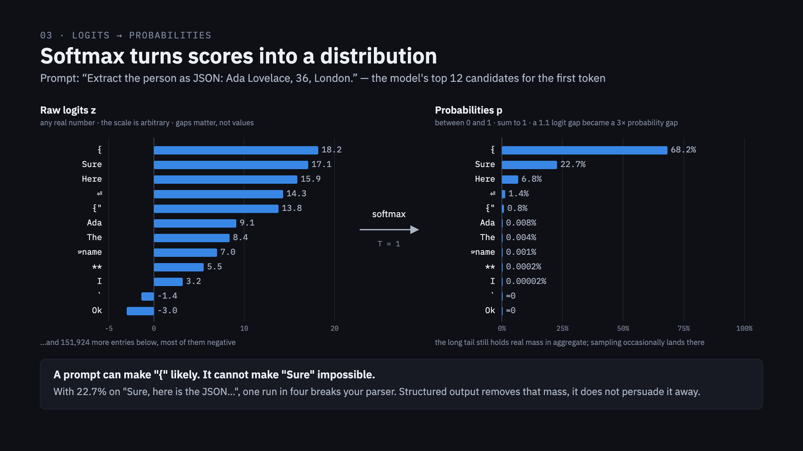
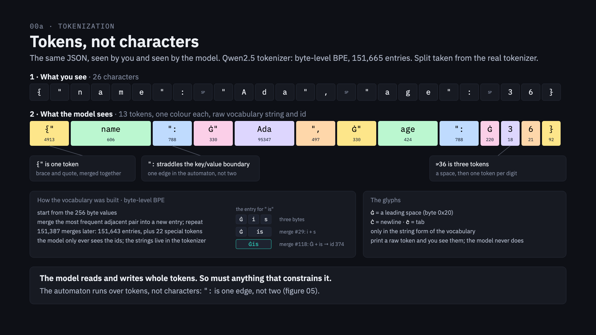
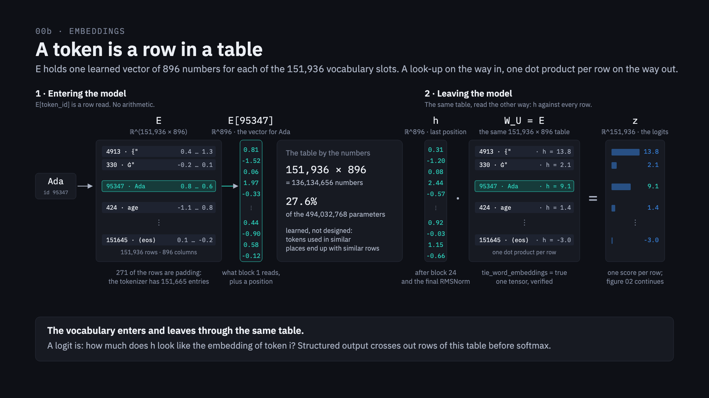
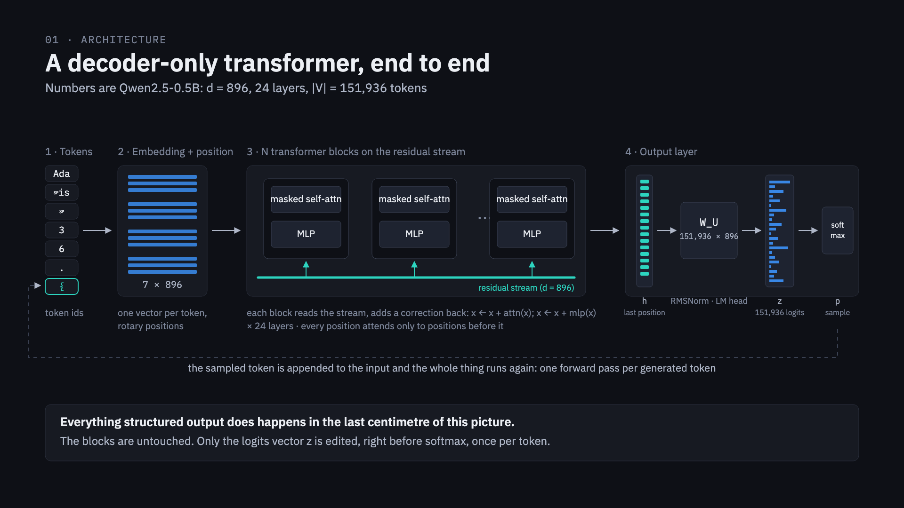
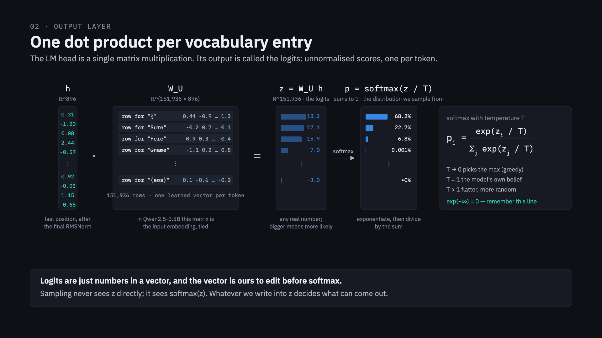
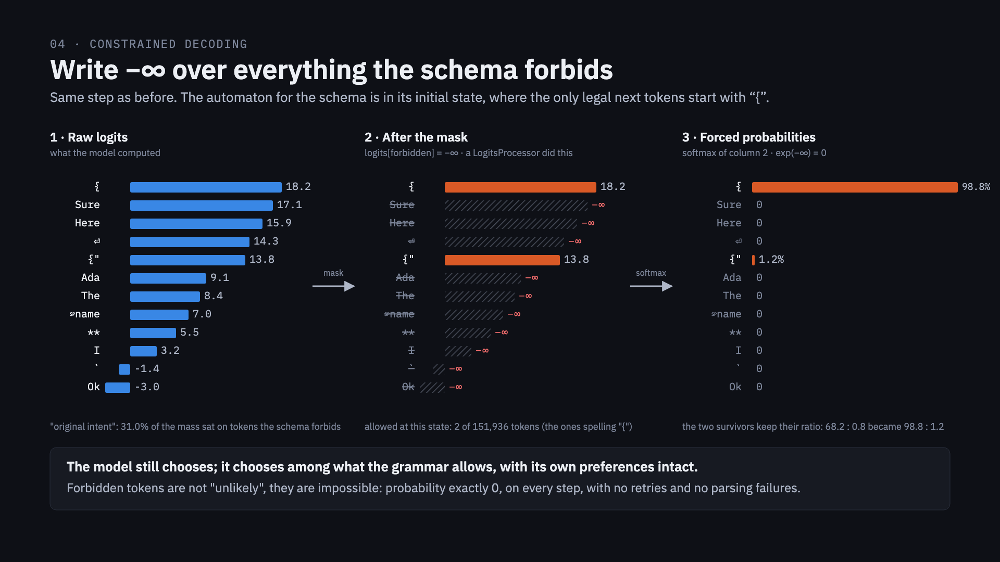
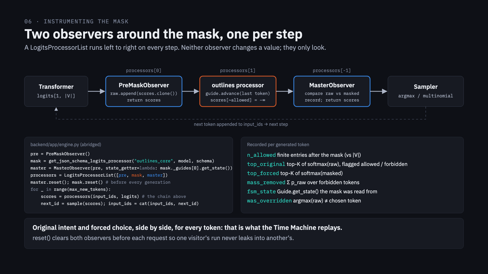
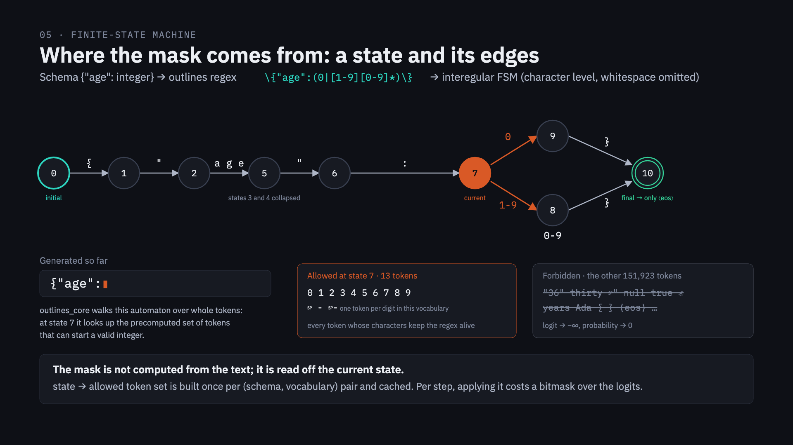
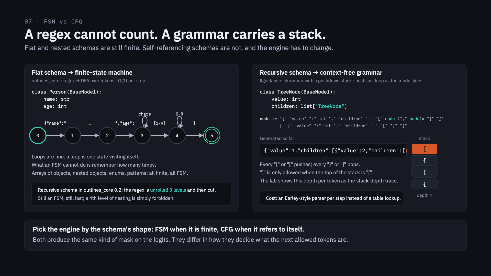

<style>
@import url("fonts/fonts.css");

:root {
  --bg: #0e1016;
  --panel: #161a24;
  --ink: #eceff4;
  --ink-2: #aeb6c7;
  --muted: #7c8599;
  --accent: #3987e5;
  --good: #2fd0a6;
  --warn: #e8703a;
}
section {
  background: var(--bg);
  color: var(--ink);
  font-family: "IBM Plex Sans", "Segoe UI", system-ui, sans-serif;
  font-size: 28px;
  padding: 64px 80px;
}
section h1 { font-size: 54px; font-weight: 600; letter-spacing: -0.01em; margin: 0 0 8px; color: var(--ink); }
section h2 { font-size: 40px; font-weight: 600; margin: 0 0 24px; color: var(--ink); }
section h3 { font-size: 30px; font-weight: 600; color: var(--ink-2); margin: 0 0 16px; }
section p, section li { line-height: 1.4; }
section ul { padding-left: 1.1em; }
section li { margin: 0.25em 0; }
section code { font-family: "IBM Plex Mono", monospace; font-size: 0.85em; background: var(--panel); padding: 0.05em 0.3em; border-radius: 4px; color: var(--ink); }
section pre { background: var(--panel); border-radius: 8px; padding: 18px 22px; font-size: 22px; line-height: 1.45; }
section pre code { background: none; padding: 0; }
section pre .hljs-string { color: var(--good); }
section pre .hljs-comment { color: var(--muted); }
section table { font-size: 22px; border-collapse: collapse; }
section th, section td { border: 1px solid #2a2f3c; padding: 8px 14px; }
section th { background: var(--panel); color: var(--ink-2); font-weight: 500; }
section table tr td { background: var(--bg) !important; color: var(--ink) !important; }
section table tr:nth-child(even) td { background: #12151d !important; }
section strong { color: var(--ink); }
section footer, section::after { color: var(--muted); font-family: "IBM Plex Mono", monospace; font-size: 16px; }
section a { color: var(--accent); }
.eyebrow { font-family: "IBM Plex Mono", monospace; font-size: 20px; color: var(--muted); letter-spacing: 0.1em; text-transform: uppercase; margin-bottom: 4px; }
.sub { font-size: 30px; color: var(--ink-2); }
.callout { background: var(--panel); border-left: 4px solid var(--accent); border-radius: 8px; padding: 18px 24px; font-size: 26px; margin-top: 28px; }
.callout strong { color: var(--ink); }
section.title { display: flex; flex-direction: column; justify-content: center; }
section.title h1 { font-size: 68px; }
section.demo { border-left: 12px solid var(--good); }
section.demo .eyebrow { color: var(--good); }
section.todo { border-left: 12px solid var(--warn); }
section.todo .eyebrow { color: var(--warn); }
section.hook { font-size: 24px; }
section.hook h2 { font-size: 34px; margin-bottom: 16px; }
section.hook .callout { font-size: 21px; margin-top: 16px; padding: 14px 18px; }
section.src pre { font-size: 19px; line-height: 1.4; padding: 14px 18px; }
section.src li { font-size: 24px; }
section.spine { display: flex; flex-direction: column; justify-content: center; }
section.spine pre { font-size: 30px; text-align: center; }
</style>

<!-- _class: title -->
<!-- _paginate: false -->

<div class="eyebrow">Tech talk · 45 min</div>

# Structured outputs: how an LLM is forced to emit valid JSON

<p class="sub">The last centimetre of the transformer.</p>

<br>

Live lab: `/fsm` · `/time-machine` · no maths beyond multiply, add, and `exp`.

<!--
Name the tabs that are already open. Set expectations: the model runs on a laptop CPU on purpose, slow enough to look at every token.
Contract with the room: twenty minutes to learn what a logit is, twenty minutes in the last centimetre with the lab live.
-->

---

<!-- _class: hook -->



<div class="eyebrow">00 · Hook</div>

## One run in four breaks your parser

- First token, measured: `{⏎` **68%**, `` ``` `` **23%**
- You wrote the fence-stripping regex because of the second bar
- A prompt can make `{` likely. It cannot make the fence impossible.

<div class="callout">This talk is about that bar: where it comes from, and how to make it exactly zero. Not persuaded away. <strong>Removed.</strong></div>

<!--
The figure shows the whole 03 slide; talk only about the right-hand panel. Figure 03 labels the second bar "Sure"; the measured second bar (2026-09-06, chat template on) is the markdown fence at 23.0%. Say "the fence" and the live step-0 panel will match.
-->

---

<!-- _class: spine -->

<div class="eyebrow">The route</div>

```
text → tokens → one vector per token → 24 blocks → one vector h
     → 151,936 logits → softmax → sample → append → repeat
```

<div class="callout">Structured output is <strong>one line</strong> written into the logits vector, right before softmax. Twenty minutes to get there. Then we stay.</div>

<!--
This is the napkin drawing. Come back to it on the last slide.
Transition: "To remove that bar I have to reach into the model. What is it choosing between? Not characters."
-->

---



<!--
Ask "how many tokens is this?" before revealing the second row: 26 characters, 13 tokens.
Walk the three call-outs: {" is one token; ": straddles the key/value boundary; " 36" is a space and then one token per digit (this model spells digits one at a time, GPT-2 does not).
Plant: "the automaton will have to walk over these coloured pieces, not over characters. Hold that thought until the /fsm demo."
Split and ids come from the real tokenizer.
-->

---

<div class="eyebrow">01 · Tokens</div>

## How the vocabulary was built: byte-level BPE

- Start from **256 bytes**
- Merge the most frequent adjacent pair; repeat until **|V| = 151,936**
- Frequent things become one token: `Ġ` `i` `s` → `Ġ` `is` (merge #29) → `Ġis` (merge #118, id 374)
- Space is spelled `Ġ`, newline `Ċ`, tab `ĉ` in the vocabulary strings. The model only sees ids.

<!--
backend/app/tracing.py BPE_GLYPHS is the two-line version of this slide. The glyph only exists in the string form of the vocabulary.
-->

---

<!-- _class: demo -->

<div class="eyebrow">Demo · Time Machine · Person tab</div>

## Count the tokens

- *Text so far*: the final JSON, one pastel per token
- Hover a token for its id and raw form
- Point at `":` and at the digits

<!--
45 seconds. Pre-recorded tab, do not scrub yet.
Transition: "So the model's world is 151,936 tokens. What does it do with a token id? It looks it up."
-->

---



<!--
Left: Ada is id 95347; E[95347] is a row read, no arithmetic. 151,936 x 896 = 136 M numbers, 27.6% of the model.
Right: the same table, read the other way: h against every row gives one logit per row. tie_word_embeddings = true, one tensor, verified on the loaded model.
"The model has no idea what Ada is. It has 896 numbers it learned to put next to Ada." Say "remember this table" and come back to it on the output-layer slide and the last slide.
Transition: "One vector per token in. Twenty-four blocks later, one much better vector per token. Here is the whole machine on one page; we walk it once."
-->

---



<!--
Walk left to right once, 90 seconds: tokens → embedding + position → 24 blocks on the residual stream → output layer.
Use the figure's caption: "Everything structured output does happens in the last centimetre. The blocks are untouched."
-->

---

<div class="eyebrow">03 · Transformer</div>

## Attention and the residual stream, in one breath

- **Attention:** each position looks at the positions before it and copies what is useful
- **MLP:** each position thinks on its own
- **Residual stream:** the running vector. Blocks add to it, never replace it: `x ← x + attn(x)`, `x ← x + mlp(x)`
- Out of block 24 comes one vector `h` per position. We only use the last one.

<!--
Intuition only, no Q/K/V. SKIP THIS SLIDE if running late; figure 01 already says it.
Transition: "Everything I care about is the bottom-right corner: one vector h, one matrix, 151,936 numbers."
-->

---



<!--
z = W_U · h. One dot product per vocabulary entry gives 151,936 scores: the logits. Any real number; the scale is arbitrary; gaps matter.
CALLBACK: W_U is the table from the embeddings slide. A logit is "how much does h look like the embedding of token i". Say it explicitly.
-->

---


<!--
Softmax: exponentiate, then divide by the sum. That is all it is.
A 1.1 logit gap became a 3x probability gap. The long tail still holds real mass in aggregate; sampling occasionally lands there.
-->

---

<div class="eyebrow">04 · Output stage</div>

## Temperature, and the line to remember

- `p_i = exp(z_i / T) / Σ_j exp(z_j / T)`
- `T → 0` picks the max (greedy) · `T = 1` the model's own belief · `T > 1` flatter
- Greedy picks the max; sampling rolls a loaded die. Neither can land on a probability of exactly 0.
- **Sampling never sees `z`. It sees `softmax(z)`.**

<div class="callout"><code>exp(−∞) = 0</code> — remember this line.</div>

<!--
The lab runs T = 0 so runs are reproducible; mention once.
The exp(-inf) line is the hinge of the talk. Say it twice.
-->

---

<!-- _class: demo -->

<div class="eyebrow">Demo · Time Machine · Person tab · step 0</div>

## The model's original intent

- Left panel *Original intent*: raw logits → softmax, the real top-K for this model and this prompt
- *Display*: Top-K 8, *Bars* → log scale to see the tail
- Nothing has been forced yet

<!--
60 seconds. Measured: {⏎ 68.5%, ``` 23.0%, {} 3.4%, {" 3.3%. "Two runs in nine start with a markdown fence. The system prompt persuaded; it did not guarantee."
Transition: "Sampling never sees the logits; it sees softmax of them. Edit the logits before softmax and you control what can come out. Here is the edit."
-->

---



<!--
Three columns, left to right. Stop on the middle one: "a LogitsProcessor did this; nothing else changed."
Forbidden tokens are not unlikely, they are impossible: probability exactly 0, every step, no retries, no parsing failures.
The model still chooses, among what the grammar allows, with its own preferences intact.
Be here by minute 21.
-->

---

<div class="eyebrow">05 · The mask</div>

## It is a hook in the decode loop

```python
processors = LogitsProcessorList([pre, proc, master])      # engine.py:182

for i in range(max_new_tokens):
    out = self.model(input_ids=cur_ids, past_key_values=past, use_cache=True)
    logits = out.logits[:, -1, :].float()
    scores = processors(all_ids, logits)                    # −∞ is written here
    next_id = self._sample(scores, temperature, top_k_sampling, generator)
```

- The model is untouched: no fine-tuning, no retraining
- This is the loop `model.generate` hides from you

<!--
backend/app/engine.py, lines 182 and 221-225, abridged.
-->

---

<!-- _class: src -->

<div class="eyebrow">05 · The mask · in the source</div>

## Don't take my word for it

```python
# transformers 5.16.1 · generation/utils.py:2920-2925, inside _sample
if do_sample:
    probs = nn.functional.softmax(next_token_scores, dim=-1)
    next_tokens = torch.multinomial(probs, num_samples=1).squeeze(1)
else:
    next_tokens = torch.argmax(next_token_scores, dim=-1)

# llguidance 1.8.0 · llguidance/torch.py:34
logits.masked_fill_(bit_masks == 0, float("-inf"))
# outlines_core 0.2.14 · outlines_core/kernels/torch.py:64
logits.masked_fill_(~bit_masks, -torch.inf)
```

- Greedy is an `argmax`; sampling is `multinomial` over the softmax. One `if`.
- Both engines hand the sampler the same thing: logits with −∞ where the schema says no
- llama.cpp's greedy (`llama_sampler_temp_impl`, T ≤ 0) writes −∞ over everything but the max. Same trick, different author of the list.

<!--
45 seconds, skippable. The full list of references, with line numbers, is in TALK.md.
Qwen's own generation_config.json asks for do_sample true, temperature 0.7, top_p 0.8, top_k 20; the lab overrides with T = 0 for reproducibility.
-->

---



<!--
45 seconds, only so the audience trusts the numbers on screen.
PreMaskObserver clones the raw logits before the mask; MasterObserver compares after. Neither changes a value.
-->

---

<!-- _class: demo -->

<div class="eyebrow">Demo · LIVE · Time Machine · Person · FSM</div>

## Watch the mask work

- **Generate**: 23 tokens in about 7 s, one forward pass each
- Scrub: *Original intent* vs *Forced*, forbidden tokens struck through
- **Overridden** at steps 0, 1, 17, 21: the model wanted `{⏎`, the mask forced `{"`
- Steps 4–8, inside `"Ada Lovelace"`: *Vocabulary kept* 96.8%, the model is free
- Step 12, after `"age":`: *Allowed tokens* **13** of 151,936

<!--
The ONLY live generation. Max new tokens 60, temperature greedy. Narrate the wait as the decode loop.
"Overridden" typically at step 0 or right after a closing quote. "Here the model is free; the schema only cares about the frame."
Transition: "That was one line of code. The whole difficulty is the other line: who fills in forbidden?"
-->

---

<div class="eyebrow">06 · The FSM</div>

## Who fills in `forbidden`? Schema → regex

- outlines compiles the JSON Schema to **one regular expression**
- `{"age": integer}` → `\{"age":(0|[1-9][0-9]*)\}`
- Keys in declared order, quoted literally; values as character classes

<div class="callout">A schema is a regex with better PR.</div>

<!--
Show the Person regex on /fsm. It is long, and that is the point.
-->

---



<!--
Regex → automaton. The text so far puts us in a state. At state 7: 1,126 tokens allowed, the other 150,810 forbidden.
KEY IDEA: the mask is not computed from the text; it is read off the current state. state → allowed set is built once per (schema, vocabulary) and cached; per step it is a bitmask over the logits.
-->

---

<!-- _class: demo -->

<div class="eyebrow">Demo · /fsm · Person tab</div>

## Character level → Token level

- *Character level*: `interegular`, one character per edge
- **Freeze layout** before pointing
- *Token level*: `outlines_core.Index(regex, vocabulary)`, one vocabulary token per edge. This is what generation walks.
- Same language, different alphabet: `":` jumps two character states in one edge

<!--
90 seconds. This is the payoff of the tokens block. Person, not Invoice (graph size).
-->

---

<div class="eyebrow">06 · The FSM</div>

## Why tokens make this hard, and why it is precomputed

- A token may cross regex boundaries; the automaton must know where each whole token lands
- For every state, test all **151,936** tokens once; keep the survivors and their target state
- That table is the **compile cost**. The per-step cost is a lookup.
- The first request for a new schema is slow; later ones are not. The lab caches 16 indexes.

<!--
Text slide, 45 seconds. engine.py:71 is the cache bound.
-->

---

<!-- _class: demo -->

<div class="eyebrow">Demo · Time Machine · Person tab</div>

## The path through the automaton

- *Token-level automaton*: the path strip `state —token→ state`, visited states tinted
- **Follow current state** on; scrub
- *Allowed tokens*: 2 at step 0, 4 before a key, 13 at the integer, ~147,000 inside a string value
- Final state: only `⟨eos⟩` is allowed. The automaton is also what stops generation.

<!--
60-90 seconds. The eos-only final state is the closing beat of the block.
Transition: "This works for anything finite: arrays of objects, nested objects, enums, patterns. Now a schema that refers to itself."
-->

---



<!--
Left panel first: loops are fine, a loop is one state visiting itself. What an FSM cannot do is remember how many times.
Right panel: every { or [ pushes, every } or ] pops; ] only when the top is [. Read the grammar line aloud.
Cost: an Earley-style parser step per token instead of a table lookup.
-->

---

<!-- _class: demo -->

<div class="eyebrow">Demo · /fsm · Tree tab</div>

## What outlines_core does with recursion

- The regex is the schema **unrolled three levels**, then cut. Still an FSM; a fourth level is simply forbidden.
- The warning under the regex: the innermost level keeps a comma before nothing, `,[ ]?\}`
- The automaton accepts `{"value": 3, }`. A parser does not.

<div class="callout">Not a bug in the idea. A bug in one unroller. But the FSM has no idea it is describing JSON.</div>

<!--
web/components/RegexView.tsx detects exactly this pattern. outlines_core 0.2.14.
-->

---

<!-- _class: demo -->

<div class="eyebrow">Demo · Time Machine · Tree · FSM tab, then CFG tab</div>

## Same mask, different machine

- **FSM tab**, four-level copy prompt: the run ends in `{"value": 4, }`, validation fails, the page explains why
- **CFG tab**, preset prompt: *Grammar engine*, the parser stack of open `{` / `[`, the depth chart pushes and pops
- The mask on the logits is the same kind. What changed is who decides the allowed set.

<!--
2 minutes, both pre-recorded. The preset prompt nests only 3 levels and stays valid; the FSM tab needs the copy prompt from TALK.md block 7 (measured: 50 steps, depth 7, ends in `, }`). Bonus on both tabs: the model invents nodes nobody asked for. Syntax, not truth.
-->

---

<div class="eyebrow">07 · The CFG</div>

## Auto mode: pick the engine by the schema's shape

```python
def is_recursive(schema) -> bool:            # backend/app/presets.py:103
    """True when some definition in `$defs` can reach itself through `$ref`s."""
```

- Finite → `outlines_core`: regex → DFA over tokens
- Recursive → `llguidance`: grammar with a stack
- Both produce the same kind of mask; they differ in how they decide the allowed set

<!--
Twenty lines; that is the whole router.
Transition: "Two engines, same mask. What does that mean for the code you ship on Monday?"
-->

---

<div class="eyebrow">08 · So what</div>

## What it costs

| | FSM · `outlines_core` | CFG · `llguidance` |
|---|---|---|
| Compile | once per (schema, vocabulary); seconds; cache it | cheap |
| Per token | bitmask lookup | a parser advance |
| Inspectable state | automaton state id | none; the stack is the state |
| Nesting | fixed (unrolled) | as deep as the model goes |

- The first request for a new schema pays the compile. The forward pass still dominates.
- Budget `max_new_tokens` so the closing brace fits.

<!--
If asked "how much slower is CFG": measurable per step, usually dominated by the forward pass.
-->

---

<div class="eyebrow">08 · So what</div>

## Pitfalls

- **Syntax, not truth.** The mask forces the frame; the model still invents the values. Every *Overridden* step is a place the model disagreed with you.
- **Engines disagree at the edges.** Extra keys: set `additionalProperties: false`. Key order, whitespace, unsupported keywords.
- **Unroll bugs are real.** An automaton can accept what a parser rejects. Always `json.loads` + validate.
- **Off-distribution.** Removing 99% of the mass is a big push. Still prompt for the format; the constraint is the safety net, not the instruction.
- **Truncation.** No automaton can force a closing brace that does not fit in the budget.

<!--
presets.py sets extra="forbid" on every model precisely for the second bullet. engine.py validates after the loop.
-->

---

<div class="eyebrow">08 · So what</div>

## When to reach for what

- **Hosted "JSON mode" / "structured outputs":** this mechanism, server-side. Hence the supported-schema subset, and the slow first call.
- **Flat or nested but finite, latency-sensitive:** FSM
- **Recursive schema, "any JSON value", non-JSON grammar (SQL, code):** CFG
- **Always:** explicit schema, `additionalProperties: false`, validate, keep a fallback for truncation

<!--
90 seconds, no story, just the list.
Transition: "Back to the table we started with."
-->

---

<!-- _class: title -->
<!-- _paginate: false -->

<div class="eyebrow">Close</div>

# The vocabulary enters and leaves through the same table.

<p class="sub">Tokens in, tokens out, through one 151,936 × 896 matrix. Structured output stands at the exit and crosses out rows before softmax.</p>

<br>

Repo · `/about` for the figures · `/fsm` · `/time-machine`

<!--
Callback to the spine slide and the embeddings slide. End on the sentence, then Q&A.
-->
